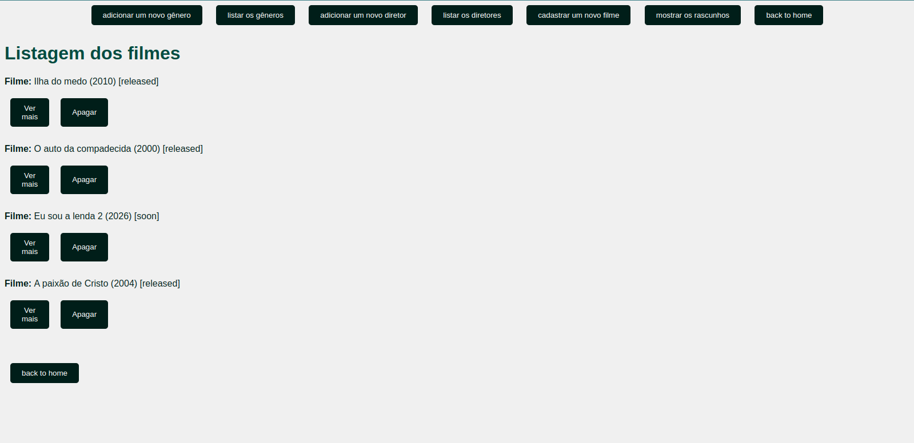

# Movie Catalog Project 🎬📚

Welcome to the Movie Catalog project! This application allows you to manage and explore a database of movies, directors, and genres. Whether you're a movie enthusiast or a filmmaker, this platform provides a comprehensive toolset for organizing and exploring film data.

***

# Features
Genre Management: Easily add and edit movie genres.
Director Management: Create and update director profiles.
Movie Management: Catalog and update movie entries.
Genre Exploration: View a list of all genres and explore movies within each genre.
Director Exploration: Browse a list of all directors and explore movies directed by each individual.
Movie Listing: Access a comprehensive list of all movies, displaying titles and release years.
Detailed Movie View: Dive deeper into a movie's details by clicking on its entry in the movie listing.

***

# Getting Started
To run this project locally, follow these steps:

Install Rails if you haven't already. You can find installation instructions [here](https://www.ruby-lang.org/pt/documentation/installation/).

Clone this repository to your local machine.

Navigate to the project directory in your terminal.

Run the following command to install dependencies:
```bundle install```

Run the database migrations:
```rails db:migrate```

Start the Rails server:
```rails server```

Access the application in your web browser at [http://localhost:3000](http://localhost:3000).

If your rails version is different from the specified, you can update your version with RVM or RBENV, or simply change the version in gemfile to match your version

To discover which ruby version you have, you may run:
```rails --version```

***

# About This Project
This project marks my first venture into Ruby on Rails development, and I'm thoroughly enjoying working with this technology. I'm excited to explore the possibilities it offers for creating dynamic web applications and diving into the world of web development.

***

# Contributing
Contributions are welcome! If you have ideas for new features or improvements, feel free to submit a pull request.

Enjoy exploring the world of cinema with the Movie Catalog project! 🍿🎥


***

# Screenshots




Happy Coding! 
### Vinigperuzzi 🧙‍♂️
